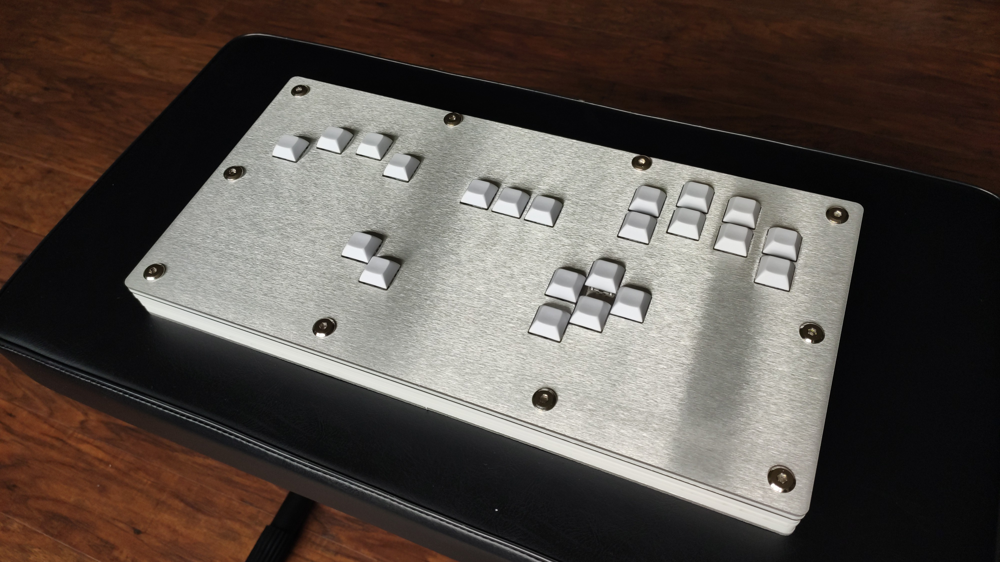
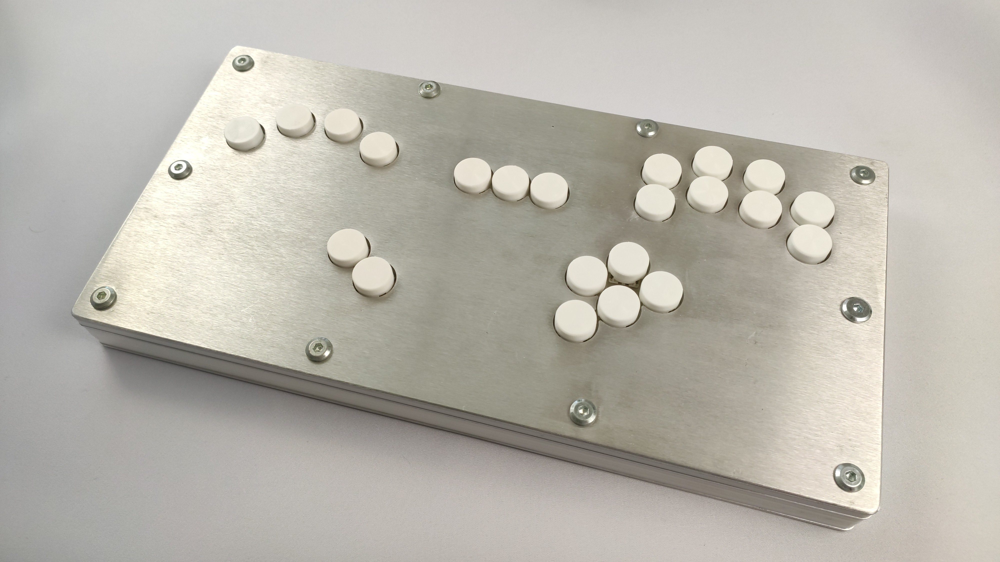

# GCCMX
A digital controller PCB/chassis design.

The PCB is originally designed to allow mounting a Model S and a Brook board, but you can also just solder wires to the through holes. The pin holes are labeled on the silk screen of the board.

## License
CL-FW is licenced under the GNU GPL Version 3. [See the included LICENSE file for details](https://github.com/Crane1195/CL-FW/blob/main/LICENSE).

## Support my work
I set up a donation link for people who appreciate my work and wish to donate. Donations are greatly appreciated, but are far from necessary:

https://www.paypal.com/donate/?hosted_button_id=NFDEML5FKR8N8